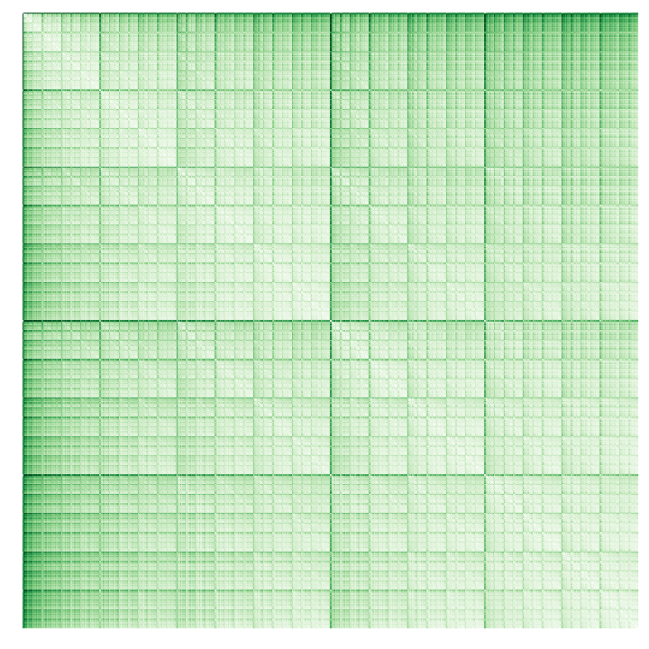
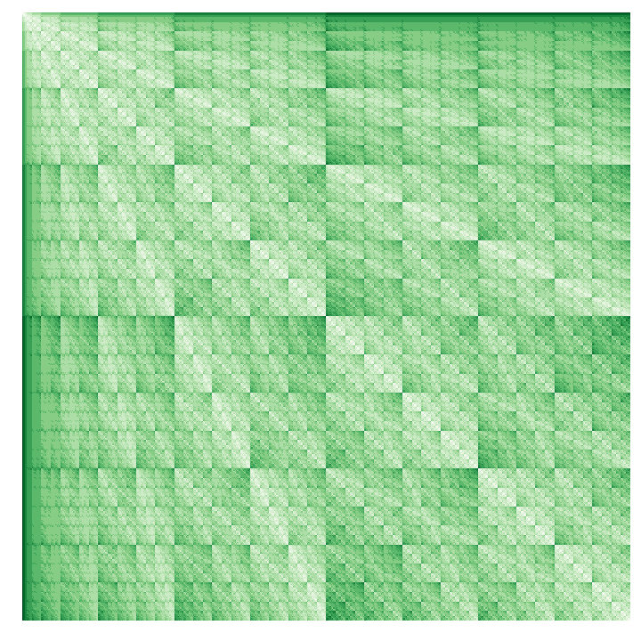
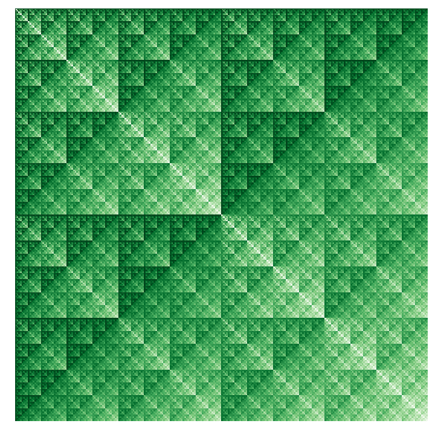

# bitpatterns
The notebook `distance_patterns`contains a visual inspection of distances between bit strings.
You can can find some of the generated patterns below.
Can you guess which distance correspond to which picture?
Here is a clue: there are the Hamming distance, the edition distance (a.k.a. Levenshtein), the Jaccard distance and the 1d wasserstein distance.

All the answers are in the notebook.
I you have problems seeing the notebook, you can go [here](http://nbviewer.jupyter.org/github/remilepriol/bitpatterns/blob/master/distance_patterns.ipynb).

